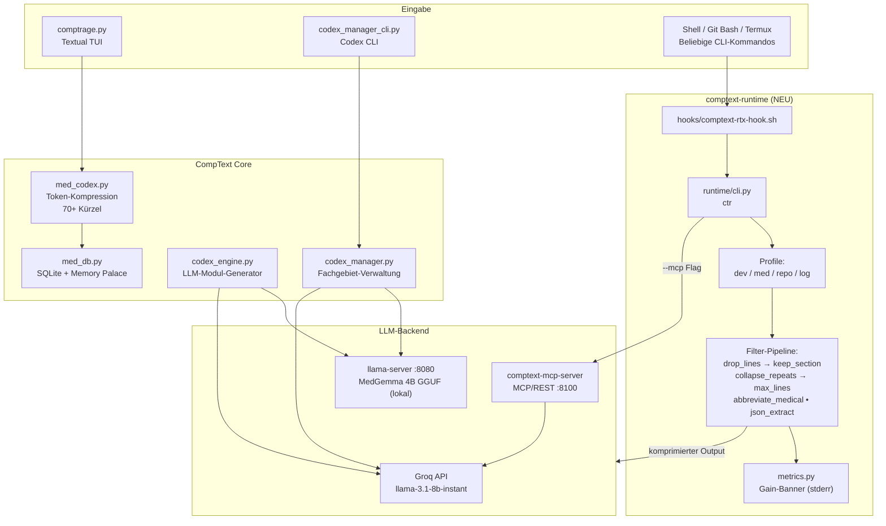
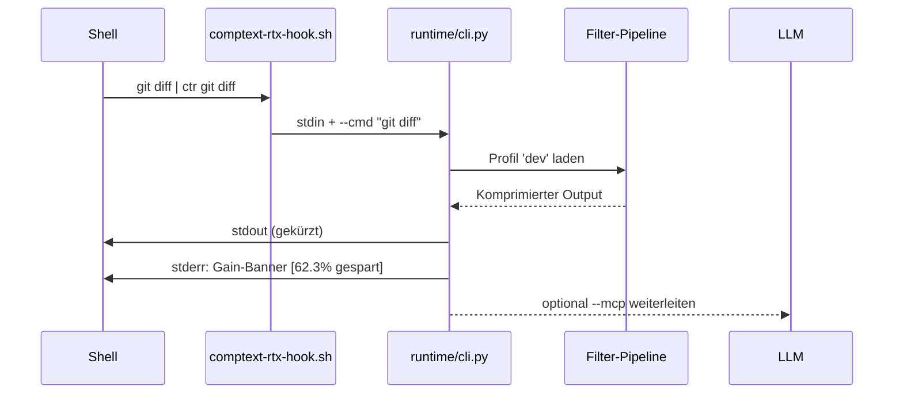

# comptext-termux-v2

[](https://www.python.org/)
[](https://termux.dev)
[](https://groq.com)
[](https://github.com/ProfRandom92/comptext-mcp-server)
[](LICENSE)
[](https://github.com/ProfRandom92/comptext-termux-v2/commits/master)

> Medizinisches Triage-System + CompText Runtime für Android/Termux & Windows.
> Offline-first, ePA-kompatibel, Touch-optimiert (Galaxy A33) — jetzt mit RTK-style Output-Kompression für LLM-Workflows.

---

## Architektur



---

## Module auf einen Blick

| Modul | Datei | Funktion |
|-------|-------|----------|
| **TUI** | `comptrage.py` | Touch-optimierte Triage-Oberfläche |
| **Codex CLI** | `codex_manager_cli.py` | LLM-gestützter Codex-Manager |
| **Codex TUI** | `codex_manager_tui.py` | Interaktive Codex-Verwaltung |
| **MedCodex** | `med_codex.py` | Token-Kompression, 70+ medizinische Kürzel |
| **MedDB** | `med_db.py` | Async SQLite, Memory Palace, Triage-History |
| **Med Specialties** | `med_specialties.py` | Fachgebiet-Definitionen |
| **Codex Engine** | `codex_engine.py` | LLM-basierter Modul-Generator |
| **Runtime** | `runtime/` | RTK-Layer: Shell-Output-Kompression |
| **MediaPipe** | `mediapipe_server.py` | Alternatives LLM-Backend (Google MediaPipe) |

---

## comptext-runtime (RTK-Layer)

Die neue `runtime/`-Schicht komprimiert Shell-Outputs **bevor sie in den LLM-Kontext** gehen — inspiriert von RTK, Snip und mcp-compressor.



### Profile

| Profil | Zuständig für | Typische Ersparnis |
|--------|---------------|--------------------|
| `dev`  | git, pytest, cargo, npm | 40–80% |
| `med`  | MedCodex, Befunde, HL7 | 30–60% |
| `repo` | ls, find, sqlite3, JSON | 50–70% |
| `log`  | tail, grep, journald | 60–90% |

### Schnellstart Runtime

```bash
# Termux:
bash scripts/install_hook_termux.sh && source ~/.bashrc

# Git Bash (Windows):
bash scripts/install_hook_gitbash.sh && source ~/.bashrc

# Danach:
ctr git diff
ctr git status
ctr pytest

# Manuell (stdin-Pipeline):
git diff | python -m runtime.cli --cmd "git diff"
```

---

## Kern-Konzept: MedCodex Token-Kompression

Statt dem LLM jedes Mal langen Klartext zu schicken:

```
Eingabe:  "MAB+HS, RR↓, HF↑ → ACS?"
Expanded: "Massive arterielle Blutung mit hämorrhagischem Schock,
           Hypotonie, Tachykardie → Akutes Koronarsyndrom?"
```

**Vorteile:**
- Weniger Tokens = schnellere Inferenz auf ARM-CPU
- ePA-kompatibel: ICD-10, LOINC, OPS integriert
- 70+ medizinische Kürzel vorinstalliert

---

## Setup

### Termux (Android)
```bash
bash setup_termux.sh
```

**Manuell:**
```bash
pkg install tur-repo && pkg update && pkg install llama-cpp
pip install textual httpx aiosqlite pyyaml

# MedGemma laden:
wget https://huggingface.co/unsloth/medgemma-1.5-4b-it-GGUF/resolve/main/medgemma-1.5-4b-it-Q4_K_M.gguf -P models/

# Tab 1 – Server:
llama-server -m models/*.gguf --port 8080 -c 2048 -t 4

# Tab 2 – App:
python comptrage.py
```

### Groq API (Empfohlen für PC/Windows)
```bash
export GROQ_API_KEY="dein-key"
python codex_manager_cli.py --status
python codex_manager_cli.py --auto-fill neurologie --count 10
```

> Neuen Key unter [console.groq.com](https://console.groq.com) generieren.

---

## Codex Manager CLI

```bash
python codex_manager_cli.py --status
python codex_manager_cli.py --auto-fill neurologie --count 20
python codex_manager_cli.py --auto-fill all --count 15
python codex_manager_cli.py --generate-skills --output ~/.hermes/skills
python codex_manager_cli.py --test-compression
python codex_manager_cli.py --export-json ~/codex_backup.json
```

---

## Quick-Events (TUI Hotkeys)

| Hotkey | Event |
|--------|-------|
| `B` | P1: Massivblutung |
| `H` | P1: ACS/Herzinfarkt |
| `A` | P1: Anaphylaxie |
| `S` | P1: Sepsis |
| `T` | P2: SHT/Sturz |
| `K` | P1: REA Kind |

---

## Repo-Struktur

```
comptext-termux-v2/
├── comptrage.py              # Haupt-TUI (Textual, Touch-optimiert)
├── codex_manager_cli.py      # Codex Manager CLI
├── codex_manager_tui.py      # Codex Manager TUI
├── codex_manager.py          # Codex Core-Logik
├── codex_engine.py           # LLM-Modul-Generator
├── med_codex.py              # Token-Kompression (70+ Kürzel)
├── med_db.py                 # Async SQLite + Memory Palace
├── med_specialties.py        # Fachgebiete
├── mediapipe_server.py       # Option B: MediaPipe Backend
├── setup_termux.sh           # Ein-Kommando-Setup
├── runtime/                  # NEU: CompText RTK-Layer
│   ├── cli.py                  #   Entrypoint: stdin → Filter → stdout
│   ├── metrics.py              #   Gain-Berechnung + Banner
│   ├── mcp_client.py           #   Optional: weiterleiten an MCP-Server
│   ├── profiles/               #   dev / med / repo / log YAML
│   └── filters/                #   7 Filter-Module
├── hooks/
│   └── comptext-rtx-hook.sh    # RTX Bash-Hook
├── scripts/
│   ├── install_hook_termux.sh  # Termux-Install
│   └── install_hook_gitbash.sh # Git Bash-Install
├── docs/
├── modules/                  # Generierte Module (via /gen)
├── skills/                   # Hermes Skill-Dateien
├── models/                   # GGUF-Modelle (nicht in Git)
└── data/                     # SQLite-DBs (nicht in Git)
```

---

## CompText Ökosystem

| Repo | Zweck |
|------|-------|
| [comptext-mcp-server](https://github.com/ProfRandom92/comptext-mcp-server) | MCP/REST-Server, Docker, CI/CD |
| **comptext-termux-v2** | Android/Termux, Triage-UI, Runtime-Layer |
| [Medgemma-CompText](https://github.com/ProfRandom92/Medgemma-CompText) | Kaggle Hackathon, ePA/FHIR |

---

*CompText Ecosystem — ProfRandom92 — 2026*
